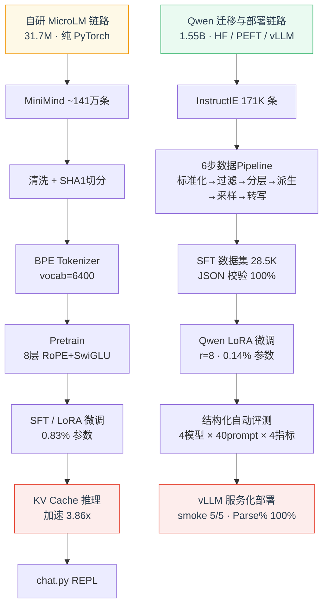

# MicroLM

轻量级 LLM 训练、微调、评测与部署全链路项目。

## 从零搭建一个能训练、能微调、能推理的完整 LLM 链路

涵盖 tokenizer 训练、语料处理、pretrain、SFT、LoRA、推理优化、评测与部署，每一个环节亲手实现。

[自研链路](#自研链路--31m-参数) · [Qwen 迁移](#迁移链路--qwen25-15b) · [快速开始](#快速开始) · [文档](#详细文档)

---

## 两线并行

| | **自研 MicroLM 链路** | **Qwen 迁移与部署链路** |
|:--:|:---:|:---:|
| **规模** | 31.7M 参数 | 1.55B 参数 |
| **技术栈** | 纯 PyTorch（einsum 自实现） | HF / PEFT / vLLM |
| **数据源** | MiniMind ~141 万条 | InstructIE 171K 条 |
| **核心能力** | Tokenizer → Pretrain → SFT → LoRA → KV Cache 推理 | 数据 Pipeline → LoRA 微调 → 自动评测 → 服务化部署 |
| **LoRA 效率** | **0.83%** 可训练参数（1.0 MB） | **0.14%** 可训练参数（8.3 MB） |



---

## 核心成果

### 自研链路 — 31.7M 参数

| 指标 | 数值 |
|:---:|:---:|
| 模型架构 | 8 层 Transformer · RoPE + SwiGLU + RMSNorm pre-norm |
| LoRA 可训练占比 | **0.83%**（262K / 31.7M） |
| Adaptor 存储 | **1.0 MB**（vs 全参 377 MB，节省 **99.7%**） |
| KV Cache 加速 | 平均 **3.86x** · 最大 **9.08x** |
| SFT 质量提升 | 评分 **+81%**（1.13 → 2.04 / 满分 5） |
| LoRA vs 全参 | 生成质量达全参 **85%**（val_loss 差距仅 9%） |

### 迁移链路 — Qwen2.5-1.5B-Instruct

| 指标 | 数值 |
|:---:|:---:|
| 基座模型 | Qwen2.5-1.5B-Instruct（1.55B 参数） |
| LoRA 可训练占比 | **0.14%**（2.18M / 1.55B） |
| Adaptor 存储 | **8.3 MB**（vs 基座 2,944 MB，节省 **99.7%**） |
| SFT 数据集 | **28.5K** train + 1.5K valid（全量 JSON 校验 **100%** 通过） |
| val_loss 降幅 | 0.3999 → **0.1534**（**61.6%**） |
| 部署决策依据 | Alias-Strict **15.0%**（为 base 的 **2 倍**），结构化质量全面领先 |
| vLLM 验证 | smoke **5/5** · stability Parse% **100%** · 单并发 ~30 tok/s |

---

## 详细文档

完整中文文档位于 [`Readme/`](Readme/) 目录：

| 文档 | 内容 |
|:---:|:---:|
| [01-项目总览](Readme/项目全景图/01-项目总览.md) | 双轨架构、核心量化成果一览 |
| [02-自研 MicroLM 主线](Readme/项目全景图/02-自研%20MicroLM%20主线.md) | 数据处理 / Tokenizer / 模型设计 / Pretrain / SFT / LoRA / 能力边界 |
| [03-推理与系统能力增强](Readme/项目全景图/03-推理与系统能力增强.md) | 文本生成流程 / KV Cache 优化与 Benchmark / chat.py 多轮对话 |
| [04-Qwen 迁移与结构化输出](Readme/项目全景图/04-Qwen%20迁移与结构化输出主线.md) | 迁移动机 / InstructIE 数据 pipeline / Qwen LoRA 微调 / 导出部署 |
| [05-评测、验证与部署闭环](Readme/项目全景图/05-评测、验证与部署闭环.md) | 通用评测体系 / 结构化自动评测 / Alias 归一化 / vLLM benchmark |
| [06-项目复盘与总结](Readme/项目全景图/06-项目复盘与总结.md) | 关键成果 / 8 个 Bug 清册 / 方法论收获 / 扩展方向 |
| [07-医疗问诊结构化记录迁移方案](Readme/项目全景图/07-医疗问诊结构化记录迁移方案.md) | 医疗问诊 schema / 提示词模板 / 微调全流程 / 强模型重构总提示词 |

> 核心代码解析：[transformer.py](Readme/核心代码解析/01-transformer.py%20模型主干.md) · [lora.py](Readme/核心代码解析/02-lora.py%20LoRA%20参数高效微调.md) · [sft.py](Readme/核心代码解析/03-sft.py%20SFT%20数据协议.md) · [data_loader & loss](Readme/核心代码解析/04-data_loader.py%20与%20loss.py.md) · [generate_text.py](Readme/核心代码解析/05-generate_text.py%20推理链路.md) · [chat.py](Readme/核心代码解析/06-chat.py%20多轮对话系统.md) · [train_qwen_lora.py](Readme/核心代码解析/07-train_qwen_lora.py%20Qwen%20迁移线核心.md) · [数据 pipeline 六步处理](Readme/核心代码解析/08-数据%20pipeline%20六步处理.md)

---

<details>
<summary><strong>目录结构</strong> （点击展开）</summary>

```
micro_LM/
├── microlm/                  # 核心 Python 包
│   ├── model/                #   transformer.py, lora.py, kv_cache.py
│   ├── tokenizer/            #   BPE tokenizer (训练 + 编码/解码)
│   ├── training/             #   optimizer, scheduler, sft.py, data_loader, loss
│   └── inference/            #   generate_text.py, prompting.py
├── scripts/                  # 可执行脚本入口
│   ├── train_pretrain.py     #   预训练
│   ├── train_sft.py          #   SFT 微调 (支持 --use-lora)
│   ├── train_qwen_lora.py    #   Qwen LoRA 微调
│   ├── train_tokenizer.py    #   BPE tokenizer 训练
│   ├── chat.py               #   交互式聊天 REPL
│   ├── 01~06_*.py            #   InstructIE 数据 pipeline (6步)
│   ├── export_final_model.py #   LoRA 合并导出
│   ├── serve_vllm.sh         #   vLLM 服务启动
│   └── smoke_vllm.py         #   vLLM 功能验证
├── tests/                    # 测试套件 (6个测试文件)
├── configs/                  # 训练/推理配置 JSON
├── eval/                     # 评测 prompt 模板
├── results/                  # 评测结果
├── data/                     # 训练数据 (大部分需自行准备)
├── Readme/                   # 详细中文文档
│   ├── 项目全景图/            #   01-06 全景文档
│   └── 核心代码解析/          #   各模块代码详解
└── pyproject.toml
```

</details>

---

## 快速开始

### 安装

```bash
git clone https://github.com/jiaran-king/MicroLM.git
cd MicroLM
python -m venv .venv
source .venv/bin/activate        # Linux/Mac
# .venv\Scripts\activate         # Windows

pip install -e ".[all]"          # 推荐：包含全部依赖
```

| 安装方式 | 命令 | 适用场景 |
|:---:|:---:|:---:|
| 核心依赖 | `pip install -e .` | 仅自研链路（纯 PyTorch） |
| +Qwen 链路 | `pip install -e ".[qwen]"` | +transformers, peft, datasets |
| +开发测试 | `pip install -e ".[dev]"` | +pytest |
| **全部安装** | **`pip install -e ".[all]"`** | **推荐** |

可选：`pip install vllm`（部署）· `pip install modelscope`（国内下载数据）

### 验证

```bash
pytest tests/                                            # 跑通测试
python scripts/train_pretrain.py --config configs/pretrain_smoke.json  # smoke 最小链路
```

<details>
<summary><strong>数据准备</strong> （点击展开下载说明）</summary>

仓库仅包含 `data/smoke/` 和 `data/sft_smoke/` 小型测试数据。完整训练数据需自行下载：

**MiniMind** — 预训练 + SFT 对话数据（自研链路）

```bash
pip install huggingface_hub

mkdir -p data data/minimind_sft/gongjy/minimind_dataset

python - <<'PY'
from huggingface_hub import hf_hub_download

hf_hub_download(
    repo_id="jingyaogong/minimind_dataset",
    repo_type="dataset",
    filename="pretrain_t2t_mini.jsonl",
    local_dir="data",
)
hf_hub_download(
    repo_id="jingyaogong/minimind_dataset",
    repo_type="dataset",
    filename="sft_t2t_mini.jsonl",
    local_dir="data/minimind_sft/gongjy/minimind_dataset",
)
PY
```

当前 MiniMind 数据集已不再提供旧版 `pretrain_hq.jsonl`。本项目现使用并已验证兼容的文件为：

- 预训练：`data/pretrain_t2t_mini.jsonl`
- SFT：`data/minimind_sft/gongjy/minimind_dataset/sft_t2t_mini.jsonl`

来源：[jingyaogong/minimind](https://github.com/jingyaogong/minimind)

**InstructIE** — 结构化信息抽取数据（Qwen 迁移链路）

```bash
pip install datasets
python -c "from datasets import load_dataset; load_dataset('zjunlp/InstructIE')"
```
来源：[zjunlp/InstructIE](https://huggingface.co/datasets/zjunlp/InstructIE)

**基座模型**

从 [HuggingFace](https://huggingface.co/Qwen/Qwen2.5-1.5B-Instruct) 下载 `Qwen2.5-1.5B-Instruct` 至项目根目录。

> 详细处理流程见 [`data/README.md`](data/README.md)

</details>

---

## 从原始数据到正式产物

下面这组命令按 **项目阶段** 排列，适合从一个全新 clone 的仓库出发，逐步生成正式训练产物。

### 自研 MicroLM 主线（阶段 A → B）

**阶段 A0 — 下载原始数据**

对应项目阶段：原始输入准备

```bash
pip install huggingface_hub

mkdir -p data data/minimind_sft/gongjy/minimind_dataset

python - <<'PY'
from huggingface_hub import hf_hub_download

hf_hub_download(
    repo_id="jingyaogong/minimind_dataset",
    repo_type="dataset",
    filename="pretrain_t2t_mini.jsonl",
    local_dir="data",
)
hf_hub_download(
    repo_id="jingyaogong/minimind_dataset",
    repo_type="dataset",
    filename="sft_t2t_mini.jsonl",
    local_dir="data/minimind_sft/gongjy/minimind_dataset",
)
PY
```

原始输入：
- `data/pretrain_t2t_mini.jsonl`
- `data/minimind_sft/gongjy/minimind_dataset/sft_t2t_mini.jsonl`

**阶段 A1 — 预训练语料清洗与切分**

对应项目阶段：MiniMind 原始语料 → `pretrain_clean/`

```bash
python scripts/prepare_pretrain_jsonl.py \
  --input-path data/pretrain_t2t_mini.jsonl \
  --output-dir data/pretrain_clean \
  --document-separator "<|endoftext|>" \
  --replace-literal "<|im_end|>=\n" \
  --replace-literal "<|im_start|>=\n" \
  --replace-literal "<think>=\n" \
  --replace-literal "</think>=\n" \
  --clean-html
```

产物：
- `data/pretrain_clean/train.txt`
- `data/pretrain_clean/valid.txt`
- `data/pretrain_clean/tokenizer_corpus.txt`
- `data/pretrain_clean/metadata.json`

**阶段 A2 — 构造 tokenizer 训练样本**

对应项目阶段：为 BPE 训练准备轻量样本

```bash
python - <<'PY'
from pathlib import Path

src = Path("data/pretrain_clean/tokenizer_corpus.txt")
dst = Path("data/pretrain_clean/tokenizer_sample.txt")
sample_bytes = 15 * 1024 * 1024

with src.open("rb") as fsrc, dst.open("wb") as fdst:
    fdst.write(fsrc.read(sample_bytes))
PY
```

产物：
- `data/pretrain_clean/tokenizer_sample.txt`

**阶段 A3 — 训练 BPE tokenizer**

对应项目阶段：Tokenizer 训练

```bash
python scripts/train_tokenizer.py --config configs/tokenizer_full_clean.json
```

产物：
- `outputs/tokenizer_full_clean/vocab.json`
- `outputs/tokenizer_full_clean/merge.txt`

**阶段 A4 — 将全文预训练语料编码成 token IDs**

对应项目阶段：文本语料 → `.npy` token IDs

```bash
python scripts/tokenize_corpus.py --config configs/tokenize_full_corpus.json
```

产物：
- `data/pretrain_clean/tokenized_full/train_ids.npy`
- `data/pretrain_clean/tokenized_full/valid_ids.npy`
- `data/pretrain_clean/tokenized_full/metadata.json`

**阶段 B1 — 正式预训练**

对应项目阶段：Pretrain

```bash
python scripts/train_pretrain.py --config configs/pretrain_full_corpus.json
```

产物：
- `outputs/pretrain_full_corpus/ckpt_final.pt`
- `outputs/pretrain_full_corpus/model_config.json`

**阶段 B2 — 正式 SFT（全参）**

对应项目阶段：SFT 微调

```bash
python scripts/train_sft.py --config configs/sft_baseline.json
```

产物：
- `outputs/sft_baseline/ckpt_final.pt`
- `outputs/sft_baseline/train_log.jsonl`

**阶段 B3 — 正式 SFT（LoRA）**

对应项目阶段：LoRA 微调

```bash
python scripts/train_sft.py --config configs/sft_lora.json
```

产物：
- `outputs/sft_lora/ckpt_final.pt`
- `outputs/sft_lora/lora_adaptor.pt`

### Qwen 迁移主线（阶段 C → D）

**阶段 C0 — 下载原始数据与基座模型**

对应项目阶段：结构化输出链路的原始输入准备

```bash
pip install huggingface_hub

mkdir -p data/instructie Qwen2.5-1.5B-Instruct

python - <<'PY'
from huggingface_hub import hf_hub_download, snapshot_download

for filename in ["train_zh.json", "valid_zh.json", "test_zh.json", "schema_zh.json"]:
    hf_hub_download(
        repo_id="zjunlp/InstructIE",
        repo_type="dataset",
        filename=filename,
        local_dir="data/instructie",
    )

snapshot_download(
    repo_id="Qwen/Qwen2.5-1.5B-Instruct",
    local_dir="Qwen2.5-1.5B-Instruct",
)
PY
```

原始输入：
- `data/instructie/train_zh.json`
- `data/instructie/valid_zh.json`
- `data/instructie/test_zh.json`
- `data/instructie/schema_zh.json`
- `Qwen2.5-1.5B-Instruct/`

**阶段 C1 — 运行 InstructIE 六步数据 pipeline**

对应项目阶段：原始抽取数据 → `sft_candidate/`

```bash
python scripts/01_normalize.py
python scripts/02_filter.py
python scripts/03_quality_tier.py
python scripts/04_derive_tasks.py
python scripts/05_stratified_sample.py
python scripts/06_to_chat_jsonl.py
```

产物：
- `data/processed/*.jsonl`
- `data/sft_candidate/train.jsonl`
- `data/sft_candidate/valid.jsonl`
- `data/sft_candidate/metadata.json`

**阶段 D1 — Qwen LoRA 正式训练**

对应项目阶段：Qwen 迁移 + 结构化输出微调

```bash
python scripts/train_qwen_lora.py --config configs/qwen_lora_structured.json
```

产物：
- `outputs/qwen_lora/adaptor_final/`
- `outputs/qwen_lora/best_adaptor/`
- `outputs/qwen_lora/train_log.jsonl`

**阶段 D2 — 导出合并后的最终模型**

对应项目阶段：部署前导出

```bash
python scripts/export_final_model.py
```

产物：
- `outputs/qwen_lora_merged_final/`

### 最小验证顺序

如果只想先确认环境和数据路径无误，不直接跑正式长任务，推荐按下面顺序验证：

```bash
pytest tests/
python scripts/train_pretrain.py --config configs/pretrain_smoke.json
python scripts/train_sft.py --config configs/sft_smoke.json
python scripts/train_qwen_lora.py --config configs/qwen_lora_structured_smoke.json
```

---

## License

MIT License. See [LICENSE](LICENSE).
"# medical-" 
"# medical" 
"# medical" 
