# MicroLM 全流程分析（训练、推理、评测与部署）

> 这篇文档的目标不是重复“项目总览”里的成果表，而是像 `cs336/推理&训练.md` 那样，从**数据流和执行路径**的角度，把 MicroLM 项目真正跑起来时的完整链路讲清楚：输入是什么，经过哪些模块，产出什么，为什么这样设计，以及两条主线之间如何衔接。

---

## 0. 文档说明

### 0.1 这篇文档解决什么问题

前面的 [[01-项目总览]]、[[02-自研 MicroLM 主线]]、[[03-推理与系统能力增强]]、[[04-Qwen 迁移与结构化输出主线]] 更强调“按主题讲故事”。这篇文档换一种组织方式：

- 不按主题拆分，而按**系统运行时的数据流**来讲
- 不先讲抽象原理，而先讲**一条输入是怎样变成输出的**
- 每一节都尽量绑定到具体脚本或模块
- 重点回答“代码到底是怎么串起来的”

它适合两个使用场景：

1. 当成项目的“系统地图”，快速建立全局理解
2. 面试或复盘时，用来解释训练、推理、评测、部署如何组成闭环

### 0.2 如何阅读这篇文档

建议按下面顺序读：

1. 先看“全局路径图”，建立两条主线的宏观地图
2. 再看“推理路径”，理解模型在运行时如何接收输入并生成输出
3. 然后看“训练路径 A / B”，分别理解自研链路和 Qwen 迁移链路
4. 最后看“评测与验证”“Bug 与工程契约”，理解为什么说这是完整闭环

### 0.3 项目的两条主线

MicroLM 不是单线项目，而是两条并行的能力验证线：

- **主线 A+B：自研 MicroLM 链路**
  从原始语料、BPE tokenizer、TransformerLM、pretrain、SFT、LoRA、KV Cache、chat REPL 一路搭到可交互推理。它证明的是“你是否真的从零实现过完整训练链路”。
- **主线 C+D：Qwen 迁移与结构化输出链路**
  从 InstructIE 原始数据出发，经过 6 步 pipeline、Qwen2.5-1.5B LoRA 微调、结构化评测、LoRA merge、vLLM 部署，形成可调用 API。它证明的是“你是否能把方法论迁移到工业工具栈并交付服务”。

两条线共享的是方法论：配置驱动、数据协议显式化、smoke-first、评测先行、报告可审计。不同的是接口层：tokenizer、chat template、LoRA 实现、部署栈都不同。

---

## 1. 全局路径图

### 1.1 全局总览图

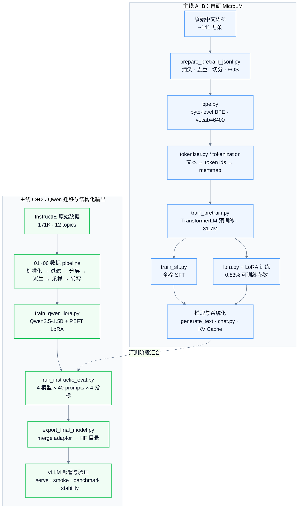

### 1.2 两条主线的关系

这两条线不是前后依赖关系，而是对照关系。

- 自研线回答“能不能从零搭起来”
- Qwen 线回答“能不能在真实开源生态里做迁移、评测、部署”
- 它们共享配置组织、日志格式、训练循环结构、报告模板
- 它们在评测阶段汇合：同一套结构化评测脚本同时比较 `qwen_base / qwen_lora / microlm_sft / microlm_lora`

因此，这个项目的本质不是“做了两个模型”，而是“用两套技术栈验证同一种工程方法论”。

---

## 2. 推理路径

这一章对应的是“模型训练完之后，权重如何真正变成可运行系统”。

### 2.1 单轮文本生成路径

对应代码：`generate_text.py` → `prompting.py` → `nn.TransformerLM.generate()`

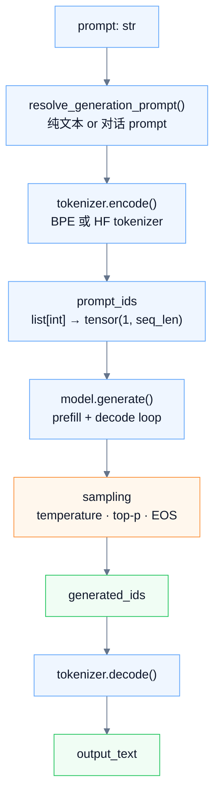

这里的关键点不是“generate 能采样”，而是**训练格式与推理格式的一致性**。

- 对 pretrain checkpoint，prompt 可以直接是纯文本
- 对 SFT / LoRA checkpoint，prompt 不能只是用户输入文本，而必须通过 `build_generation_prompt()` 渲染成训练时见过的对话格式
- assistant 标记、换行、EOS 边界只要有一个字符不一致，模型的首 token 分布就会偏掉，生成质量会静默下降

### 2.2 MicroLM 模型内部的前向路径

对应代码：`nn.py` 中的 `TransformerLM.forward()`

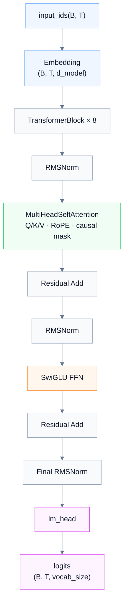

这条路径的工程意义在于：

- 自定义 `Linear` 使用 `einsum`，让权重结构透明，便于后续 LoRA 注入
- RoPE、RMSNorm、SwiGLU 都是现代 LLM 的关键部件，不是简化版 Transformer
- pre-norm 结构让训练稳定，也更适合后续 KV Cache 推理路径

### 2.3 多轮对话路径

对应代码：`chat.py` + `sft.py`

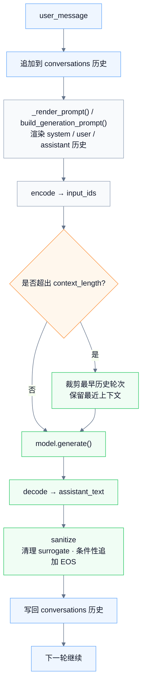

多轮路径比单轮脚本复杂的地方不在模型，而在**状态管理**：

- history 会逐轮累积
- prompt 会越来越长，需要裁剪策略
- surrogate 字符、越界 token、EOS 处理这些 bug 只会在第二轮、第三轮之后暴露
- 这类问题不是单次生成能发现的，必须在 REPL 场景下才能暴露出来

### 2.4 KV Cache 推理路径

对应代码：`TransformerLM.forward(... use_cache=True ...)`、`benchmark_kvcache.py`

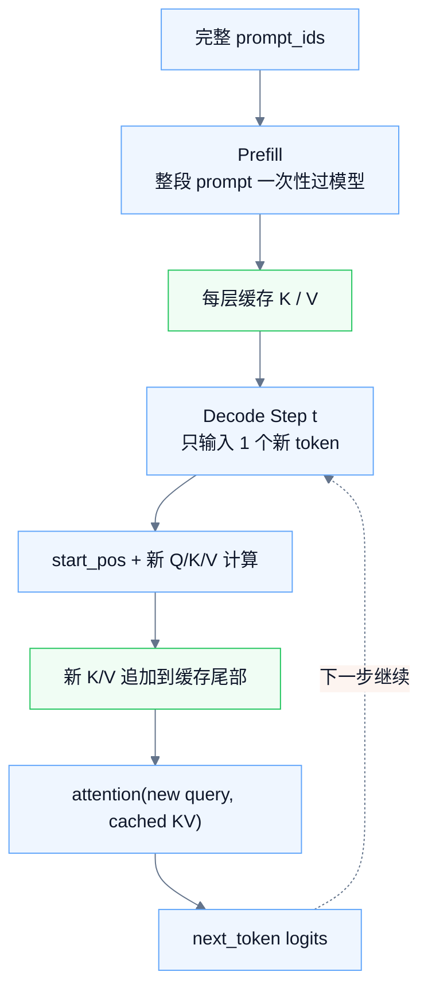

这里的核心收益是：

- 不使用 cache 时，每生成一个 token 都要把完整历史序列重新前向一遍
- 使用 cache 后，历史 token 的 K/V 只算一次，decode 时只处理新 token
- 因此计算量从“重复全序列计算”变成“新 token 对历史缓存做注意力”

项目里的 benchmark 给出的结论是：

- CPU float32 环境下平均加速 **3.86x**
- 最大加速 **9.08x**
- cache 路径的 decode 吞吐更稳定，适合在线系统延迟控制

### 2.5 Qwen / vLLM 服务推理路径

对应代码：`export_final_model.py` → `serve_vllm.sh` → `smoke_vllm.py`

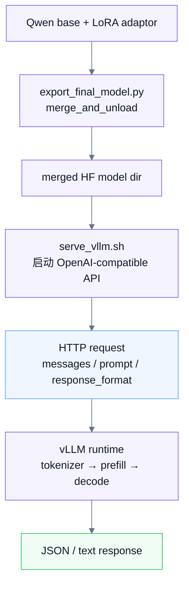

这条路径和自研 `generate_text.py` 的区别是：

- 自研线是“脚本式推理”或“终端 REPL”
- Qwen 线是“服务化推理”，入口已经不是 Python 函数调用，而是 HTTP API
- `response_format=json_object` 在结构化输出场景中很重要，它不是训练本身的一部分，而是服务层对输出行为的进一步约束

到这一步，模型已经从“checkpoint 文件”升级成“可以被任何客户端调用的服务”。

---

## 3. 训练路径 A：自研 MicroLM

这一章讲的是从原始语料一路走到自研模型训练与微调的完整路径。

### 3.1 预训练数据准备

对应代码：`prepare_pretrain_jsonl.py`

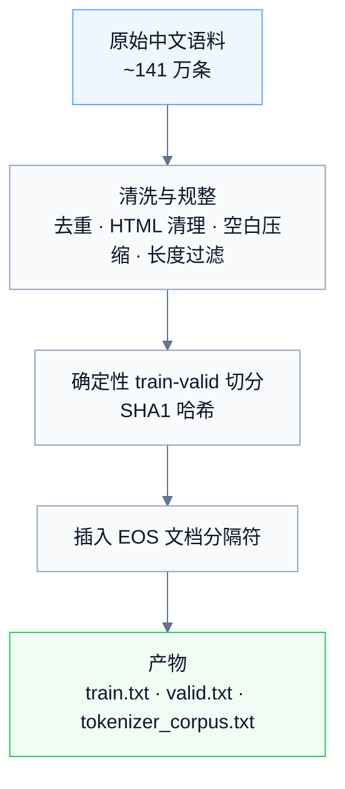

这一阶段的重点不是“做了多少清洗”，而是两点：

- **确定性**：切分和清洗结果可复现，不会因为随机种子不同而变化
- **协议意识**：文档边界通过 EOS 显式编码，后续模型能在 pretrain 阶段感知样本边界

### 3.2 BPE 训练路径

对应代码：`bpe.py`

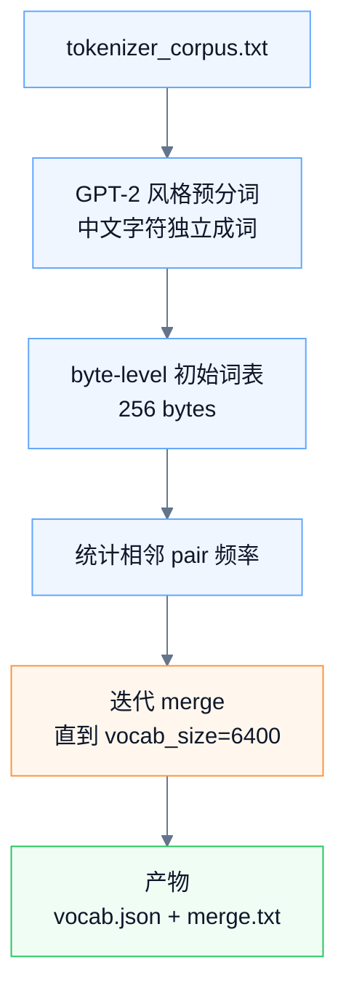

为什么这一步重要：

- 它定义了模型的“输入语言”
- MicroLM 的 embedding 层、lm_head、tokenized memmap 都依赖这一词表
- 后续出现的 `vocab_size 与 embedding 不匹配` bug，本质上也是从这里延伸出来的契约问题

为什么选 `vocab=6400`：

- 对 31.7M 微型模型来说，小词表能减少 embedding 参数占比
- 但代价也很明确：结构化 JSON 输出时 token 效率偏低，这后来成为迁移到 Qwen 的动机之一

### 3.3 Tokenization 与 memmap

对应代码：`tokenizer.py` 与 tokenization 脚本

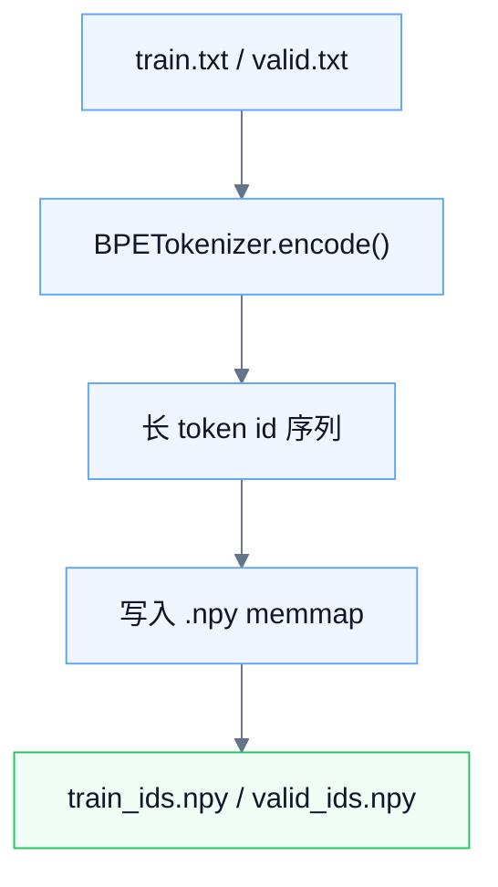

为什么使用 memmap：

- 语料规模大，不适合一次性全量加载到内存
- 预训练时不需要保留“样本边界”，只需要一条长 token 流
- memmap 允许 `get_batch()` 在磁盘映射数组上随机切窗口，节省内存并简化 data loader

这一步完成后，文本数据就被转化成训练可消费的底层格式：连续 token 序列。

### 3.4 TransformerLM 模型前向路径

对应代码：`nn.py`

模型配置核心参数：

- `vocab_size = 6400`
- `context_length = 512`
- `d_model = 512`
- `num_layers = 8`
- `num_heads = 8`
- `d_ff = 1344`
- `rope_theta = 1_000_000`

模型路径可以概括为：

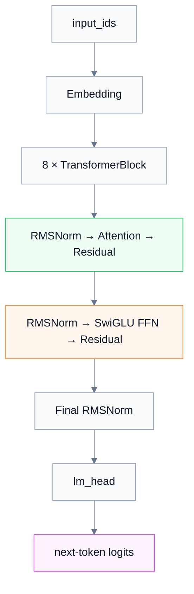

这个设计的价值在于：

- 不是课堂作业级别的“最小 Transformer”，而是带有现代 LLM 架构元素的微型模型
- 结构足够接近真实 LLM，因此后续 LoRA、KV Cache、SFT 协议这些能力才能自然接上
- 同时参数规模控制在 31.7M，使项目仍然可以在个人设备上迭代

### 3.5 Pretrain 训练循环

对应代码：`train_pretrain.py` + `data_loader.py`

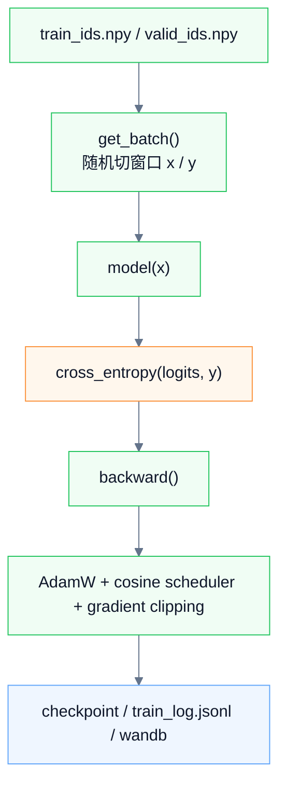

这一环节里，最关键的设计不是优化器本身，而是三件事的配合：

- **随机窗口采样**：从长 token 流中直接取窗口，天然实现 shuffle
- **warmup + cosine decay**：控制学习率，避免开头不稳定和后期震荡
- **gradient clipping**：把全局梯度范数约束在安全范围内

Pretrain 完成后的主要产物是 `ckpt_final.pt`，它是后续 SFT 和 LoRA 的权重起点。

### 3.6 SFT 数据协议与训练路径

对应代码：`sft.py` + `train_sft.py`

这是自研链路里最关键的“协议层”。

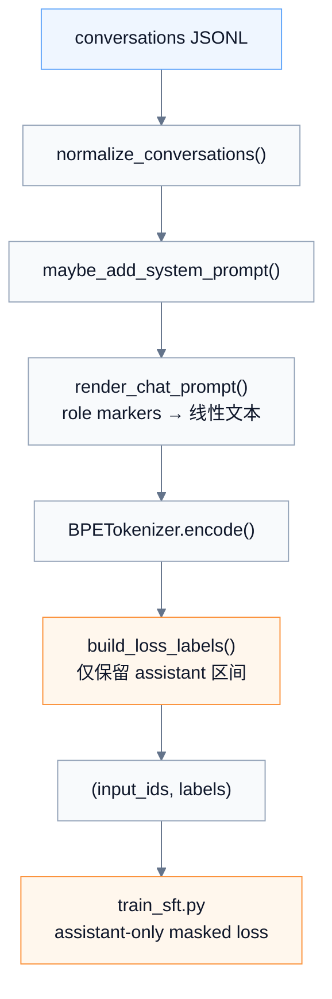

这一节的核心设计是：**只有 assistant 回复区间参与 loss**。

这意味着：

- 模型不会浪费容量去学习“预测 user 标记”“复读 prompt”
- pretrain 阶段学到的语言建模能力不会被 prompt 区间的梯度污染
- 微调目标聚焦到“如何生成一个好的 assistant 回复”

这套思路后来在 Qwen 线上被复用了，只是定位 assistant 区间的方式从“显式 markers”变成了“prefix 对比法”。

### 3.7 LoRA 接入与参数高效微调路径

对应代码：`lora.py`

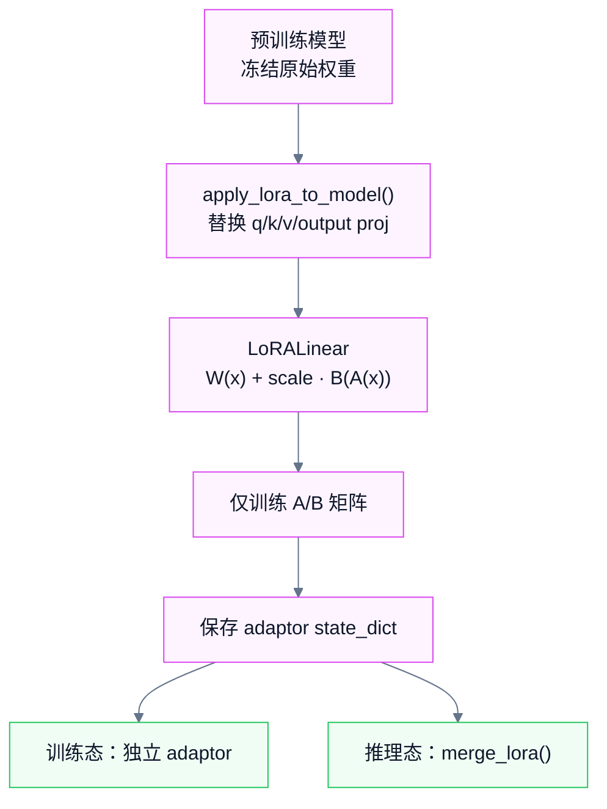

LoRA 路径的重要性在于它把“训练一个模型”拆成了两个部分：

- base model：保存通用能力
- adaptor：保存任务适配增量

因此你可以：

- 只训练 0.83% 的参数
- 只保存约 1MB 的 adaptor
- 在推理前选择 merge 或不 merge

它是自研线中最直接体现“参数高效微调”思想的部分。

---

## 4. 训练路径 B：Qwen 结构化输出线

这一章讲的是从 InstructIE 原始数据一路走到结构化微调与部署的完整路径。

### 4.1 为什么迁移到 Qwen

迁移不是因为自研线失败，而是因为它已经足够清楚地展示了能力边界。

证据链是这样的：

- MicroLM 证明了完整训练链路可行
- 但在结构化评测中，`microlm_sft / microlm_lora` 的 JSON Parse% = 0%
- 这不是简单的参数没调好，而是模型容量、词表效率、训练数据类型共同造成的边界
- 如果目标转向 schema-guided 结构化输出，就必须换更强基座

因此，Qwen 线的出发点是一个明确判断：**自研微型模型适合验证训练链路，不适合承担结构化输出主任务**。

### 4.2 InstructIE 六步数据 pipeline

对应代码：`01_normalize.py` ~ `06_to_chat_jsonl.py`

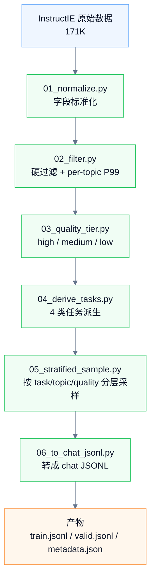

这条 pipeline 的价值，不仅是把 171K 原始数据变成 28.5K 训练集，而是把“数据处理”变成了一个**可审计系统**：

- 每一步有独立目标
- 阈值集中在 `conf.py`
- 每一步有统计报告
- 最终数据是 100% JSON 合法的

换句话说，数据集不是“清洗出来的”，而是“工程化构建出来的”。

### 4.3 四类任务为什么这样设计

四类派生任务分别承担不同训练信号：

- `ie_extraction`：核心任务，教模型按 schema 从文本抽取结构化信息
- `text_to_json`：强化“把文本压成 JSON 结构”这件事
- `format_following`：强化只输出 JSON、不带额外解释的行为约束
- `schema_repair`：通过人为扰动正确答案，让模型学习纠错与约束修复

这一步很重要，因为它说明 Qwen 线不是简单“把 IE 数据拿去 SFT”，而是在刻意塑造结构化输出行为。

### 4.4 Qwen LoRA 微调路径

对应代码：`train_qwen_lora.py`

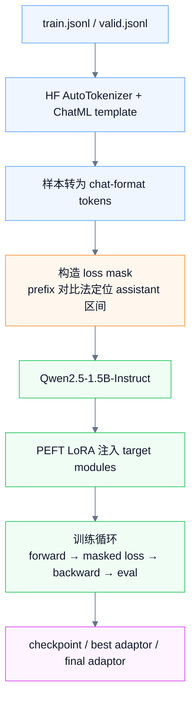

与自研 SFT 相比，这条路径有四个关键变化：

- tokenizer 从自研 BPE 变成 HF `AutoTokenizer`
- 对话模板从自定义 role markers 变成 ChatML
- LoRA 从自研 `LoRALinear` 变成 PEFT 注入
- assistant 区间定位从显式 marker 变成 prefix 对比法

但这些变化都属于**接口层变化**，而非方法论变化。方法论仍然是：

- 数据协议先行
- 只训练需要训练的部分
- mask 只作用于真正的 supervision 区间
- 训练、验证、checkpoint、日志都是完整闭环

### 4.5 导出与部署准备路径

对应代码：`export_final_model.py`

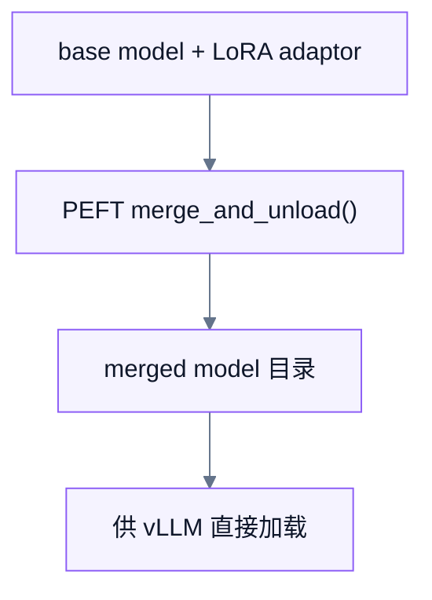

这一步的意义是把“训练产物”从“需要额外 adaptor 的组合形态”转换成“可被部署框架直接消费的标准 HF 目录结构”。

它是训练和服务之间的桥梁：

- 训练阶段关心参数如何高效更新
- 部署阶段关心模型目录如何被标准推理框架读取
- merge 的目的不是提高训练效果，而是降低部署复杂度

---

## 5. 评测与验证路径

如果只有训练而没有评测，这个项目最多只是“跑通了脚本”；如果只有评测而没有部署，它又只是“实验报告”。真正构成闭环的是训练、评测、部署三者串起来。

### 5.1 自研链路评测路径

对应内容：固定 prompt 评测 + KV Cache benchmark

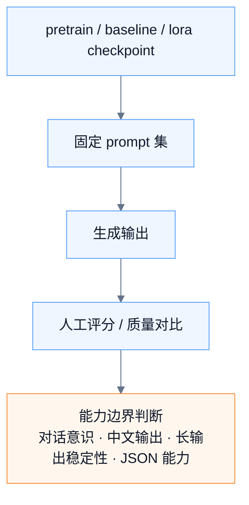

它回答的问题是：

- SFT 是否比 pretrain 更有对话意识
- LoRA 是否在极低参数开销下接近全参 SFT
- 小模型的能力边界在哪里

这里得出的关键结论是：

- SFT 明显提升了基础问答和中文生成
- LoRA 达到与全参相近的一档效果
- 但长输出会进入 repetition loop，结构化 JSON 输出能力几乎为零

### 5.2 结构化评测路径

对应代码：`run_instructie_eval.py`

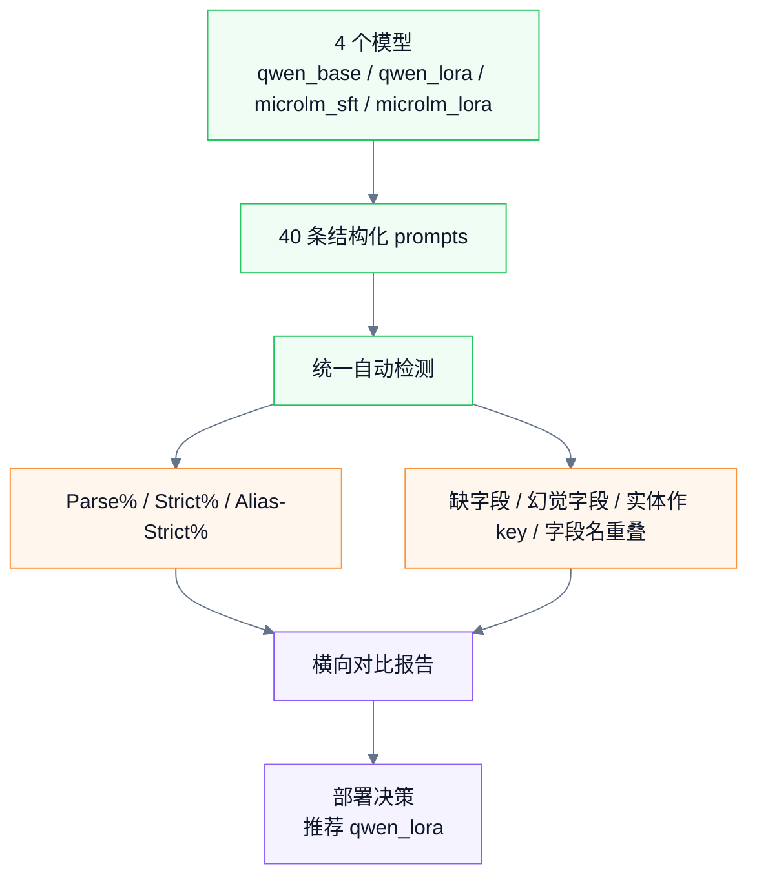

这一步非常关键，因为它把“模型感觉更好”转换成了“模型在结构化任务上到底好多少”。

最终结论不是模糊的，而是明确的：

- `qwen_lora` 在结构化行为塑形上明显优于 base
- `microlm_*` 在结构化输出上几乎不具备可用性
- 因此部署对象应该是 `qwen_lora`

### 5.3 部署验证路径

对应代码：`smoke_vllm.py`、`bench_vllm_local.py`、`check_structured_stability.py`

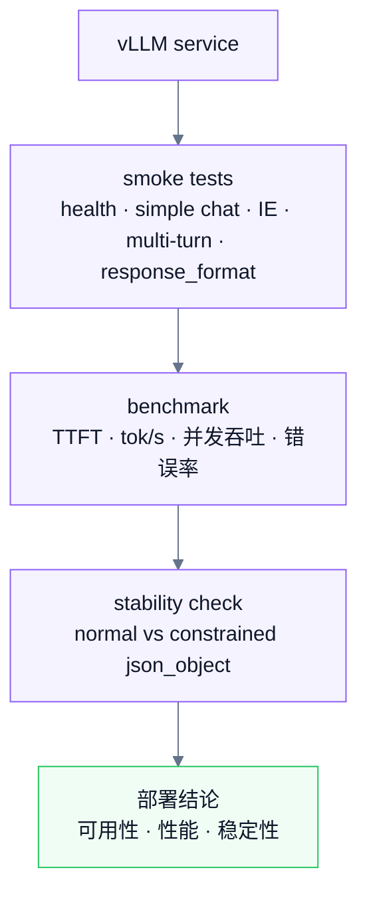

这一步回答三个层次的问题：

- **能不能用**：服务是否正常启动，API 是否响应
- **用得怎么样**：TTFT、吞吐、并发性能是否达标
- **上线后会不会退化**：服务化环境中的结构化输出是否比离线评测变差

最终，你得到的不是“模型已部署”这种泛泛表述，而是一组可以复述的工程结论：

- smoke 5/5 通过
- 单并发约 29~32 tok/s
- 多并发零错误
- constrained 模式下 Parse%=100%

---

## 7. 张量形状速查

这一节不是完整推导，而是为了在读代码时快速定位张量在哪一层变成什么形状。

### 7.1 Pretrain 路径

```text
input_ids         : (B, T)
embeddings        : (B, T, d_model)
Q/K/V             : (B, h, T, d_head)
attn_scores       : (B, h, T, T)
attn_output       : (B, T, d_model)
ffn_hidden        : (B, T, d_ff)
logits            : (B, T, V)
labels            : (B, T)
loss              : scalar
```

### 7.2 SFT 路径

```text
input_ids         : (B, T)
labels            : (B, T)
masked labels     : assistant 区间保留 token id，其余为 -100
logits            : (B, T, V)
loss              : scalar（仅 assistant 区间贡献）
```

### 7.3 LoRA 路径

```text
x                 : (B, T, d_model)
W(x)              : (B, T, d_out)
A(x)              : (B, T, r)
B(A(x))           : (B, T, d_out)
LoRA output       : W(x) + scale * B(A(x))
```

### 7.4 KV Cache 路径

```text
prefill input      : (B, T)
cached K/V         : 每层 (B, h, T, d_head)
decode input       : (B, 1)
new K/V            : 每层 (B, h, 1, d_head)
concat 后 cache    : 每层 (B, h, T+1, d_head)
```

### 7.5 Qwen 结构化训练路径

```text
chat tokens        : (B, T)
attention mask     : (B, T)
labels             : (B, T)
masked labels      : 仅 assistant response 区间有效
model logits       : (B, T, V_qwen)
loss               : scalar
```

---

## 8. 最终结论

### 8.1 这个项目最终验证了什么

MicroLM 项目最终验证的不是单一技术点，而是一套端到端方法论：

- 从零实现完整训练链路是可行的
- 参数高效微调不是大模型专属，微型模型上也成立
- 方法论可以跨技术栈迁移：自研 PyTorch 与 HF/PEFT/vLLM 可以共享同一套工程组织方式
- 聚焦结构化输出之后，评测和部署都能建立在硬指标之上

### 8.2 自研线和迁移线各自证明了什么

自研线证明的是：

- 你理解 tokenizer、模型、训练循环、loss mask、LoRA、KV Cache 的底层实现
- 你能把这些组件从零搭起来，并跑通一条完整链路

迁移线证明的是：

- 你能把方法论迁移到更强基座和更成熟的工具生态
- 你能完成数据治理、结构化评测、模型导出、服务化部署
- 你不仅能训练模型，还能把它做成可验证、可调用的服务

### 8.3 为什么说它是完整闭环

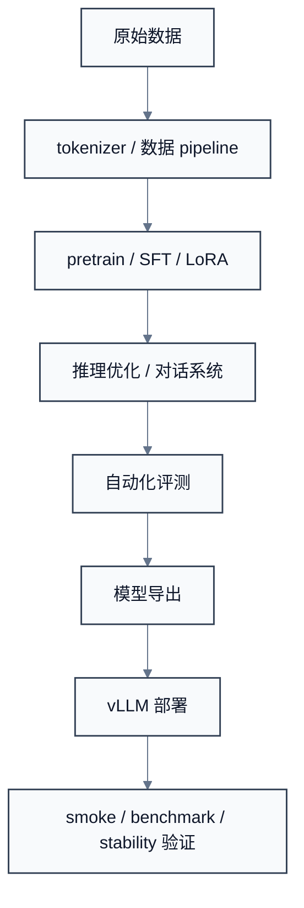

每一步都有对应产物、对应指标、对应脚本、对应验证方法。项目不是停在“loss 降了”这一层，而是走到了“服务可用、行为可测、性能可复现”这一层。

这也是它最有价值的地方：它不是一组散落的实验，而是一条真正闭合的 LLM 工程路径。

---

## 相关记录

- [[01-项目总览]]
- [[02-自研 MicroLM 主线]]
- [[03-推理与系统能力增强]]
- [[04-Qwen 迁移与结构化输出主线]]
- [[05-评测、验证与部署闭环]]
- [[06-项目复盘与总结]]
